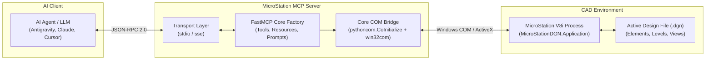

# Kiến Trúc Hệ Thống (Architecture)

## 1. Tổng Quan

Dự án **MicroStation V8i MCP Server** đóng vai trò là lớp cầu nối (bridge middleware) theo chuẩn giao thức **Model Context Protocol (MCP)**, cho phép các mô hình ngôn ngữ lớn (LLM) và các AI Agent tương tác trực tiếp, hai chiều với phần mềm thiết kế CAD Bentley MicroStation V8i.



---

## 2. Các Thành Phần Cốt Lõi

### 2.1. Lớp Truyền Tải (Transports)
- **`stdio` (Mặc định):** Giao tiếp qua standard input / standard output bằng các gói JSON-RPC 2.0. Được cấu hình mã hóa UTF-8 nghiêm ngặt nhằm tránh lỗi Unicode trên Windows. Mọi output log được định tuyến riêng về `sys.stderr`.
- **`sse` (Server-Sent Events):** Cung cấp endpoint HTTP/SSE phục vụ trường hợp chạy server trên máy trạm riêng hoặc tích hợp qua mạng nội bộ.

### 2.2. Lớp Giao Thức MCP (MCP Layer)
- **Tools:** Đóng gói các hàm thao tác thành schema JSON và xử lý validation kiểu dữ liệu trước khi gửi sang COM.
- **Resources:** Cung cấp thông tin trạng thái theo định danh URI (ví dụ `ms://drawing/info`).
- **Prompts:** Cung cấp các kịch bản tương tác mẫu nhằm tối ưu hóa chất lượng câu trả lời và hành động của LLM.

### 2.3. Lớp Cầu Nối COM (Core Bridge)
- MicroStation V8i cung cấp thư viện TypeLib `MicroStationDGN.Application`.
- FastMCP chạy trên mô hình bất đồng bộ (AnyIO/threadpool), do đó mỗi luồng worker truy cập COM bắt buộc phải gọi `pythoncom.CoInitialize()` để thiết lập Apartment-Threaded Context hợp lệ.
- Lớp `MicroStationBridge` đóng gói việc khởi tạo này và tự động phục hồi kết nối tới instance MicroStation đang chạy.

---

## 3. Cấu Trúc Thư Mục

```text
microstation-mcp/
├── README.md                   # Giới thiệu & Cài đặt
├── AGENTS.md                   # Hướng dẫn hành vi cho AI Agent
├── pyproject.toml              # Metadata dự án & dependencies
├── requirements.txt            # Danh sách thư viện Python
├── docs/                       # Tài liệu kỹ thuật
│   ├── architecture.md         # Kiến trúc hệ thống
│   ├── features.md             # Danh mục tính năng
│   └── instructions.md         # System instructions
└── src/
    ├── main.py                 # Entry point chính
    ├── core/                   # COM Bridge kết nối MicroStation
    ├── server/                 # McpServer factory, context, logging
    ├── tools/                  # Các module công cụ
    ├── resources/              # Các dynamic resources
    ├── prompts/                # Các prompt templates
    └── transports/             # Cơ chế stdio và sse
```
